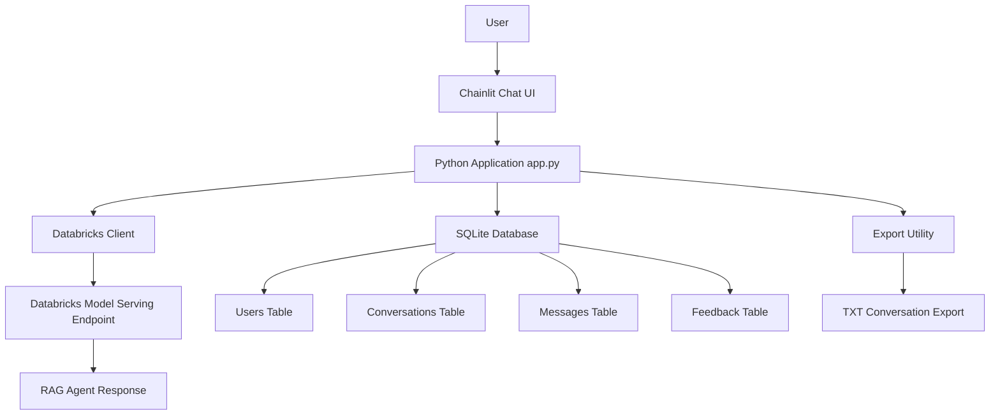
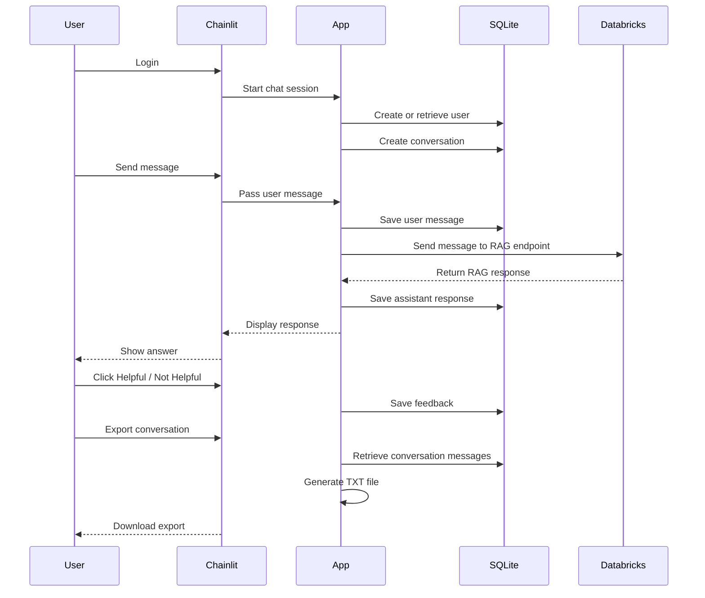
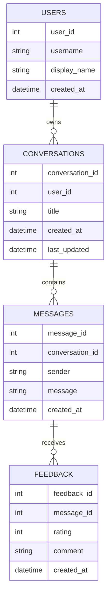

# Project Architecture

## Databricks RAG Chainlit Chatbot

This project uses Chainlit as the chatbot interface and connects to a Databricks Model Serving endpoint that hosts a RAG agent. SQLite is used to store users, conversations, messages, and feedback.

## High-Level Architecture

## Application Flow

## Main Components

| Component              | Purpose                                             |
| ---------------------- | --------------------------------------------------- |
| Chainlit UI            | Provides the web-based chatbot interface            |
| app.py                 | Main application logic and Chainlit event handlers  |
| databricks_client.py   | Sends user questions to the Databricks endpoint     |
| SQLite database        | Stores users, conversations, messages, and feedback |
| database/repository.py | Contains database helper functions                  |
| export_utils.py        | Generates downloadable conversation export files    |
| .chainlit/config.toml  | Stores Chainlit UI branding and configuration       |

## Database Relationship

## Future Production Authentication

The current project uses simple Chainlit password authentication for demonstration.

In a production environment, this can be replaced with Azure Active Directory or enterprise SSO. The authenticated user identity can then be mapped to the existing SQLite user table or a production database.
